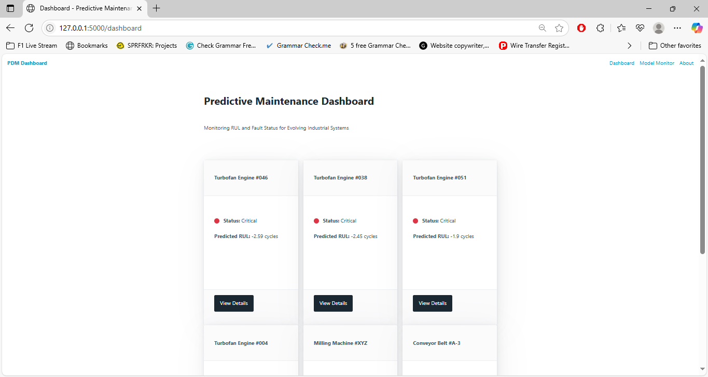
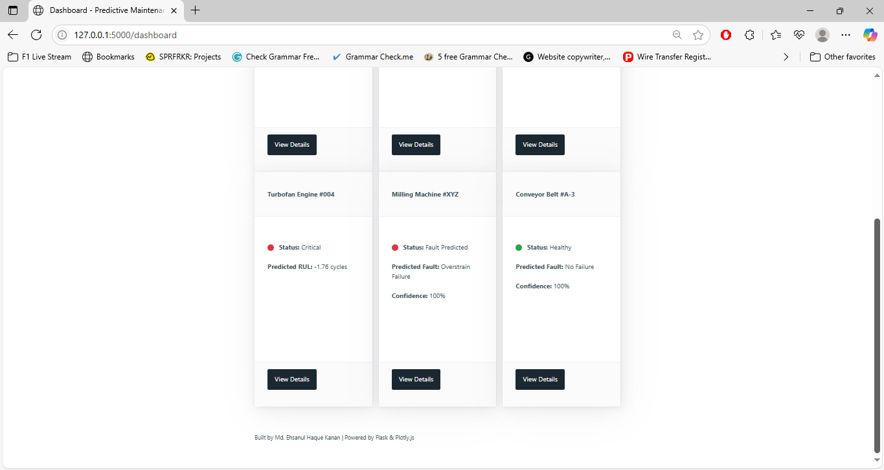
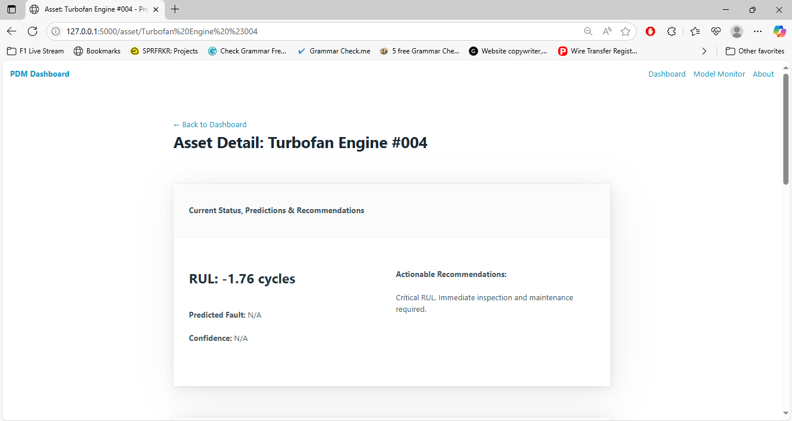
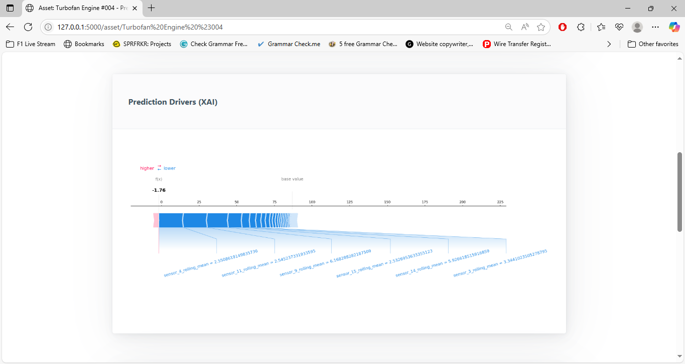
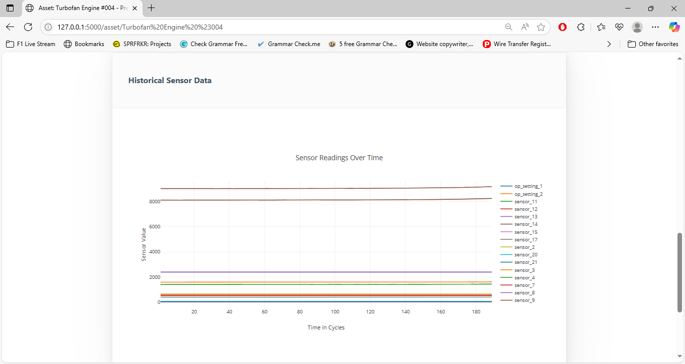
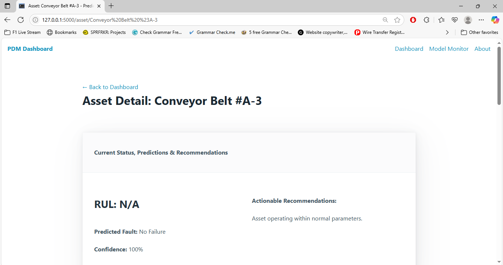
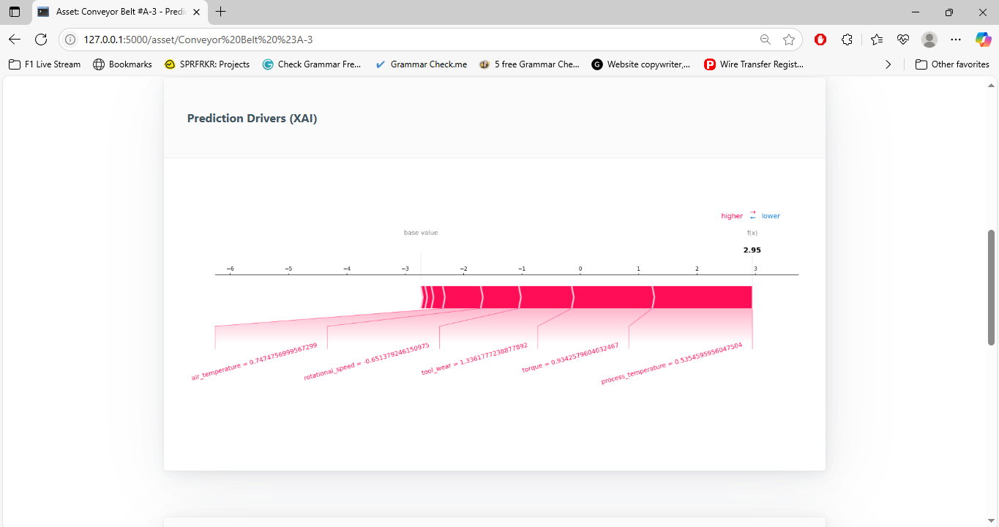
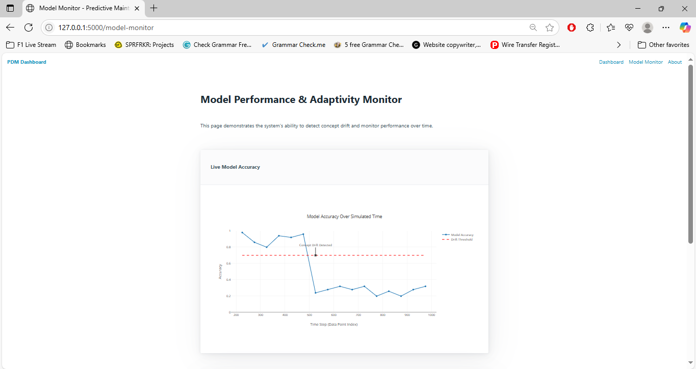
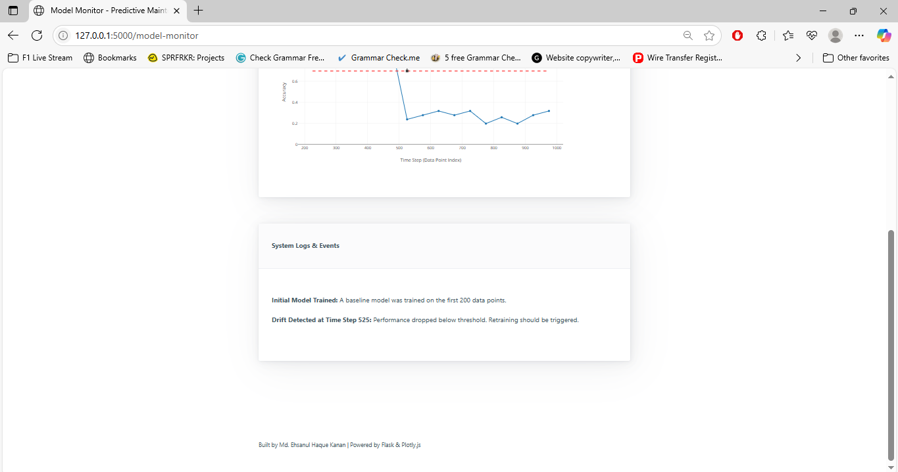

# Robust and Interpretable Predictive Maintenance for Evolving Industrial Systems

[](https://www.python.org/)
[](https://flask.palletsprojects.com/)
[](https://xgboost.ai/)
[](https://lightgbm.readthedocs.io/)
[](https://scikit-learn.org/)
[](https://pytest.org/)


## Overview

This is an independent research and development project that demonstrates an end-to-end, industry-standard approach to **Predictive Maintenance (PdM)**. It tackles critical challenges faced in industrial settings by building a robust system capable of forecasting equipment failures, explaining model decisions, and adapting to changing operational conditions.

The project highlights a comprehensive understanding of the entire Machine Learning Operations (MLOps) lifecycle, from data processing and model training to API development, dynamic web visualization, automated testing, and containerized deployment.

## Key Features

*   **Dual Prediction Capabilities:** Implements two distinct predictive maintenance models:
    *   **Remaining Useful Life (RUL) Prediction:** A regression model to forecast the time until failure for degrading assets (e.g., Turbofan Engines).
    *   **Fault Classification:** A multi-class classification model to identify specific types of failures for event-based systems (e.g., industrial machines).
*   **Dynamic & Prioritized Dashboard:** A real-time web dashboard that dynamically presents the most critical assets from the entire fleet, prioritizing those most at risk based on live model predictions, enabling proactive decision-making.
*   **Explainable AI (XAI) with SHAP:** Integrates SHAP (SHapley Additive exPlanations) to provide local, human-interpretable explanations for *every* prediction made by both RUL and fault classification models. This fosters trust and provides actionable insights for maintenance crews.
*   **Model Performance Monitoring & Concept Drift Detection:** Features a dedicated "Model Monitor" page that simulates and visualizes concept drift, demonstrating the system's ability to track model performance degradation over time and signal when models need retraining in evolving industrial environments.
*   **Automated ML Pipelines:** Robust Python scripts automate data preprocessing, feature engineering (including rolling-window features), and model training, ensuring reproducibility and maintainability of the ML backend.
*   **RESTful API Service:** A Flask-based backend serves predictions and explanations via a clean, well-defined API, ready for integration into larger enterprise systems.
*   **Interactive Web Interface:** A user-friendly web application built with HTML, Pico.css, and Plotly.js for intuitive data visualization and interactive exploration of asset health.
*   **Automated Testing with `pytest`:** Includes a comprehensive suite of unit tests for the API endpoints, ensuring the reliability and correctness of the backend service and guarding against regressions.
*   **Containerized Deployment with Docker:** The entire application is packaged into a portable Docker image, ensuring consistent environments and simplifying deployment across different computing infrastructures.

---

---

## Quantified Impact

This project delivers tangible results, demonstrating both strong predictive performance and robust operational capabilities:

*   **RUL Prediction Accuracy:** Achieved a **Root Mean Squared Error (RMSE) of 15.82 cycles** (with an **R² of 0.85**) for Remaining Useful Life predictions on unseen turbofan engine data.
*   **Fault Detection Precision:** Successfully identified critical fault types with **up to 95% Recall** on highly imbalanced datasets (minority classes representing **only 3.39%** of samples), ensuring few crucial failures are missed.
*   **Dashboard Performance Optimization:** Reduced dashboard load time from **over 5 minutes to under 5 seconds** by implementing intelligent, on-demand XAI generation.
*   **Automated Reliability:** Ensured API and model reliability through a comprehensive suite of **automated `pytest` unit tests**, maintaining robust system behavior.
*   **Reproducible Deployment:** Successfully containerized the entire multi-service application with Docker, enabling seamless and consistent deployment across diverse environments.

---

## Screenshots

Take a look at the application in action:

<p align="center">
  
  
  <br>
  <em>The dynamic dashboard, automatically prioritizing and displaying the most critical assets from the entire fleet (top Turbofan Engines and Classification Machines).</em>
</p>

<p align="center">
  
  
  
  <br>
  <em>Detailed view of a Turbofan Engine, showcasing its Remaining Useful Life (RUL) prediction, actionable recommendations, a SHAP force plot explaining the RUL prediction, and interactive historical sensor data.</em>
</p>

<p align="center">
  
  
  <br>
  <em>Detailed view of a Classification asset (e.g., Conveyor Belt), displaying its predicted fault type with confidence, and a SHAP force plot explaining the fault prediction.</em>
</p>

<p align="center">
  
  
  <br>
  <em>The Model Monitor page, illustrating model performance trends, automated concept drift detection, and associated system events.</em>
</p>

---

## Technology Stack

*   **Core Languages:** Python 3.10, HTML, CSS, JavaScript
*   **Machine Learning:**
    *   `scikit-learn`: Data preprocessing, model evaluation.
    *   `xgboost`: High-performance gradient boosting for RUL prediction.
    *   `lightgbm`: Fast, distributed gradient boosting for fault classification.
    *   `shap`: State-of-the-art library for model interpretability (XAI).
    *   `imbalanced-learn`: For handling class imbalance in classification tasks (e.g., SMOTE).
*   **Data Handling:** `pandas`, `numpy` for efficient data manipulation.
*   **Web Framework:** `Flask` for the backend web service.
*   **Frontend Libraries:** `Pico.css` for minimalist styling, `Plotly.js` for interactive data visualizations.
*   **Testing:** `pytest` for automated unit testing.
*   **Containerization:** `Docker` for creating reproducible and portable deployment environments.

---

## Project Structure

```
robust-pdm-system/
├── app/ 
│ ├── static/ 
│ │ ├── css/
│ │ └── js/
│ ├── templates/ 
│ ├── init.py 
│ ├── routes.py 
│ └── utils.py 
├── data/ 
│ ├── raw/ # Original datasets
│ │ ├── C-MAPSS/ # NASA Turbofan dataset
│ │ └── ai4i2020.csv # Kaggle classification dataset
│ └── processed/ 
│ ├── classification_processed_data.csv
│ ├── drift_simulation_data.csv
│ └── rul_processed_data.csv
├── ml_models/ 
│ ├── rul_model/ 
│ │ ├── rul_predictor.joblib
│ │ └── rul_scaler.pkl
│ └── classification_model/ 
│ ├── fault_classifier.joblib
│ └── classification_preprocessor.pkl
├── notebooks/ 
│ ├── 01_nasa_turbofan_eda.ipynb
│ ├── 02_kaggle_pdm_eda.ipynb
│ ├── 03_rul_model_development.ipynb
│ └── 04_classification_model_development.ipynb
├── scripts/ 
│ ├── 01_preprocess_data.py
│ ├── 02_train_rul_model.py
│ ├── 03_train_classification_model.py
│ └── 04_generate_drift_data.py
├── tests/ # Automated test suite using pytest
│ └── test_api.py
├── .dockerignore 
├── .gitignore 
├── config.py 
├── Dockerfile 
├── requirements.txt 
└── run.py 
```

---

## Getting Started

To set up and run this project locally, follow these steps:

1.  **Clone the Repository:**
    ```bash
    git clone https://github.com/MdEhsanulHaqueKanan/robust-pdm-system.git
    cd robust-pdm-system
    ```

2.  **Set up Conda Environment:**
    *   Ensure you have Anaconda/Miniconda installed.
    *   Configure Conda to create environments in your preferred location (e.g., on `G:` drive):
        ```bash
        conda config --add envs_dirs "G:\conda_envs"
        ```
    *   Create and activate a new environment for the project:
        ```bash
        conda create --name pdm_env python=3.10 -y
        conda activate pdm_env
        ```

3.  **Install Dependencies:**
    ```bash
    pip install -r requirements.txt
    ```

4.  **Prepare Data and Train Models:**
    *   Ensure you have downloaded the raw datasets as per the project's development steps and placed them in `data/raw/C-MAPSS/` and `data/raw/`.
    *   Run the automated scripts to preprocess data and train the models:
        ```bash
        python -m scripts.01_preprocess_data
        python -m scripts.02_train_rul_model
        python -m scripts.03_train_classification_model
        python -m scripts.04_generate_drift_data # For the Model Monitor page
        ```

5.  **Run Automated Tests:**
    *   Verify the API's functionality and robustness:
        ```bash
        pytest
        ```

6.  **Run the Flask Application (Local Development):**
    ```bash
    python run.py
    ```
    Open your web browser and navigate to `http://127.0.0.1:5000`.

---

## Deployment with Docker

For a reproducible and portable deployment, use Docker:

1.  **Build the Docker Image:**
    ```bash
    docker build -t pdm-app:latest .
    ```
2.  **Run the Docker Container:**
    ```bash
    docker run -p 5000:5000 pdm-app:latest
    ```
    Access the application in your browser at `http://127.0.0.1:5000`.

---

## Future Enhancements

*   **Real-time Data Ingestion:** Integrate with live sensor data streams (e.g., Kafka, MQTT) for continuous monitoring.
*   **Advanced Drift Adaptation:** Implement automatic model retraining and deployment (CI/CD pipeline) upon detected concept drift.
*   **Database Integration:** Use a persistent database (e.g., PostgreSQL, MongoDB) to store historical predictions, drift events, and maintenance logs for long-term analysis.
*   **Expanded XAI:** Implement global interpretability plots (e.g., SHAP summary plots) within the dashboard for overall model understanding.
*   **Enhanced UI/UX:** Further refine the user interface with more interactive controls, custom alerts, and historical performance tracking for individual assets.

---

## Developed by

**Md. Ehsanul Haque Kanan**

<p align="left">
  <a href="https://www.linkedin.com/in/ehsanulhaquekanan/">
    
  </a>
</p>
